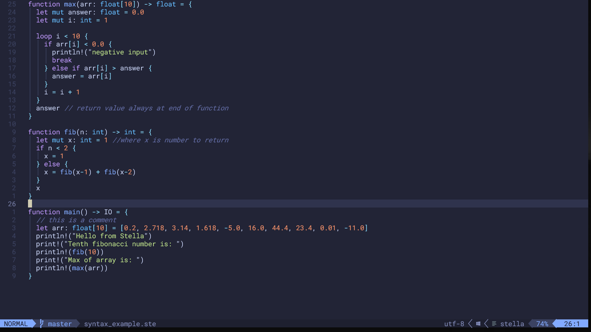

# Stella

## Name

- Acronym: Strongly Typed Expression Lightweight LAnguage
- stella means star in Italian
- named after flower found in the alps "Stella Alpina"

## Purpose

Stella has 3 main aims:

- to be simple and accessible to learn
- to include features making it easy to write bug-free code
- to be fast, making it practical to be used

The combination of these make it's best use-case scientific modelling. It is easy to learn and it's code executes very quickly. (Note: the project is not developed enough to be a realistic option for professional use).

## Features

- transpiles into Go, which is a very fast compiled language
- pointers/references are disallowed
- pass by value only
- These two make Stella impossible to use for embedded/systems programming. However, for the intended use case of data modelling, these encourage a simple flow of data through functions as the program executes.
- C-like syntax. This will make it familiar to people with experience in languages such as Python, Javascript, and Go
- static typing. This makes it easier for the developer to create a complex and bug-free program, while also enabling the transpiling to the fast compiled language Go.
- mathematically intuitive syntax (subjective). Some of Stella's syntax is inspired by functional languages such as Haskell (e.g. -> for function return type).

## Installation:

- [Install Latest Version of Go](https://go.dev/doc/install) - necessary as Stella code transpiles into Go
- Note that Stella was developed to work with go 1.21, it is possible that in the future the Go team will make changes to the language meaning that Stella is no longer compatible with the latest version
- download the example_setup directory, which contains prebuilt binaries
- (you can then rename the directory and move it to anywhere on your computer)
- Note: only tested on Windows, this may not work on other Operating Systems

### Alternative:

- [Install Latest Version of Go](https://go.dev/doc/install)
- [Install Rust](https://www.rust-lang.org/tools/install) - required to build the CLI
- build the transpiler using the `go build` command in the src/cli directory
- build the CLI using the `cargo build` command in the src/stella directory
- copy the binaries you built into a new directory (in any location on your machine)

## Usage:

Use the command line to interact with Stella's transpiler and CLI. You must be in a directory that contains both stella.exe and cli.exe.

- the command `stella new module_name` creates a new Stella module with the following structure

```
stella_projects
    stella.exe
    cli.exe
    project_1
        src
            main.ste
        tp
            main.go
            go.mod

```

- you should write your Stella code in main.ste.
- the command `stella tp module_name/src/main.ste module_name/tp/main.go` transpiles your code from src/main.ste into tp/main.go. The tp directory contains the transpiled Go files as well as metadata files.
- the command `stella build module_name` builds the transpiled go code in your module into an excutable file
- the command `stella run module_name` can be called after you have build your module into an executable. It runs the executable file in your terminal.
- NOTE: all of these commands should be executed from the parent directory of module_name, which should contain the files stella.exe and cli.exe

## Support:



I made some syntax highlighting plugins. They are not perfect, but should be useful for people who want to try out the language.

**NeoVim**: [Stella-nvim](https://github.com/all-c-a-p-s/Stella-nvim)

**VSCode**: [Stella-Lang](https://marketplace.visualstudio.com/items?itemName=StellaLang.stella-lang)

## Contributing

Not currently accepting contributions as this is a school project.
