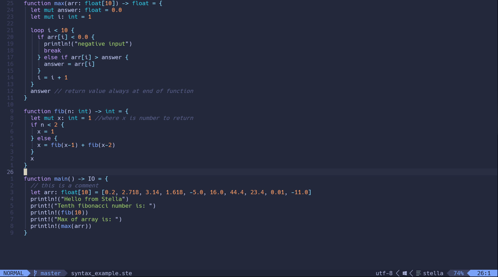
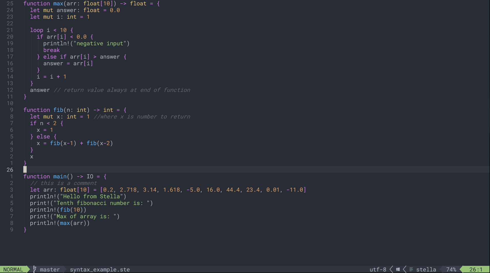
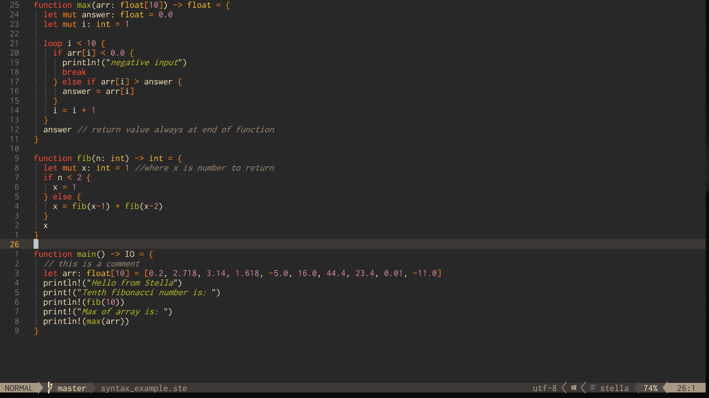

# Stella-nvim

Syntax highlighting plugin for the [Stella](https://github.com/all-c-a-p-s/Stella) programming language

##### Tokyonight:


##### OneDark:


##### Gruvbox:


## Installation

You can install Stella-nvim with a package manager such as lazy 

```
{ "all-c-a-p-s/Stella-nvim" },
```

## Usage

Enable the syntax highlighting with the command ```:syntax on```

You will also need to run the ```:syntax on``` command after changing colorscheme in neovim.
